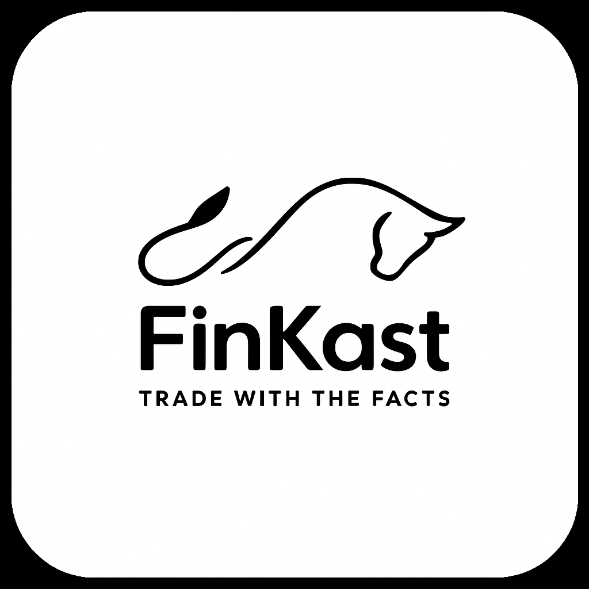

# Hi, I'm Andrew Davis

Cloud Architect and Data Engineer with 10+ years steering science-forward, mission-critical programs across government agencies including NASA, DoD, and FDA. Experience delivering cloud-native, massively distributed data platforms on hyperscaler infrastructure, blending petabyte scale lakehouses, event-driven ETL, and knowledge-graph pipelines with DevSecOps-grade CI/CD and MLOps. Proven track record of managing client and stakeholder relationships, aligning technical strategies with organizational goals and leading engineering teams to deliver and integrate full stack solutions. I turn complex mission objectives into secure, high-impact solutions that drive innovation in regulated environments.

  
  
  

##  Skills

- **Languages**: Python, SQL, HCL/Terraform, C#, Typescript, Javascript
- **Libraries/Frameworks**: React, PySpark, Beautiful Soup, Pandas, Scikit-learn, TensorFlow, PyTorch, Great Expectations
- **Tools**: Amazon Web Services (AWS), Git, Apache Spark, GitHub Actions
- **Techniques**: Machine Learning, Natural Language Processing, Time Series Forecasting, Feature Engineering, Continuous Integration & Continuous Deployment, Data Ontology Development

##  Projects

- **[FinKast Market Intelligence](https://github.com/FinKast)**  
A deep interest in the financial markets led me to embark on a personal project that helps make better sense of the buzz of global markets. I have spent the last five years developing and improving a cloud-native app that blends quantitative analytics with generative AI summaries to surface sharable, actionable investment insights.

- **[James Webb Image Processing](https://github.com/Andrew-S-Davis/JWST)**  
This project was inspired by a desire to share James Webb Space Telescope imagery with my family. It automatically retrieves the latest JWST image from the MAST archive, processes it through image stacking and colorization workflows, and delivers a polished version via email to subscribers. The goal is to make cutting-edge space imagery accessible and engaging without requiring any technical setup from the recipient.

- **[Personal Webpage](https://github.com/Andrew-S-Davis/andrew_davis_site)**
 My personal website serves as a platform to share my technical projects, write about lessons learned in software architecture, and showcase work that goes beyond what fits into a repository. It is the place where I explore ideas, document my journey, and connect with others.

##  About Me
Expanding boundaries is at the core of my personal philosophy. I enjoy a balance of pushing myself mentally and physically to attain new heights— whether it be in the literal sense, hiking one of Colorado’s many 14ers, or in the abstract, learning about the nuances climate has on the caramelization characteristics of coffee beans. I have always been driven by a deep, unrelenting curiosity. This passion for exploration fuels my constant desire to learn and understand the smallest details of the world we live in.

Reach me at **andrew.s.davis11@gmail.com** or connect on [LinkedIn](https://www.linkedin.com/in/andrewstephendavis/).
